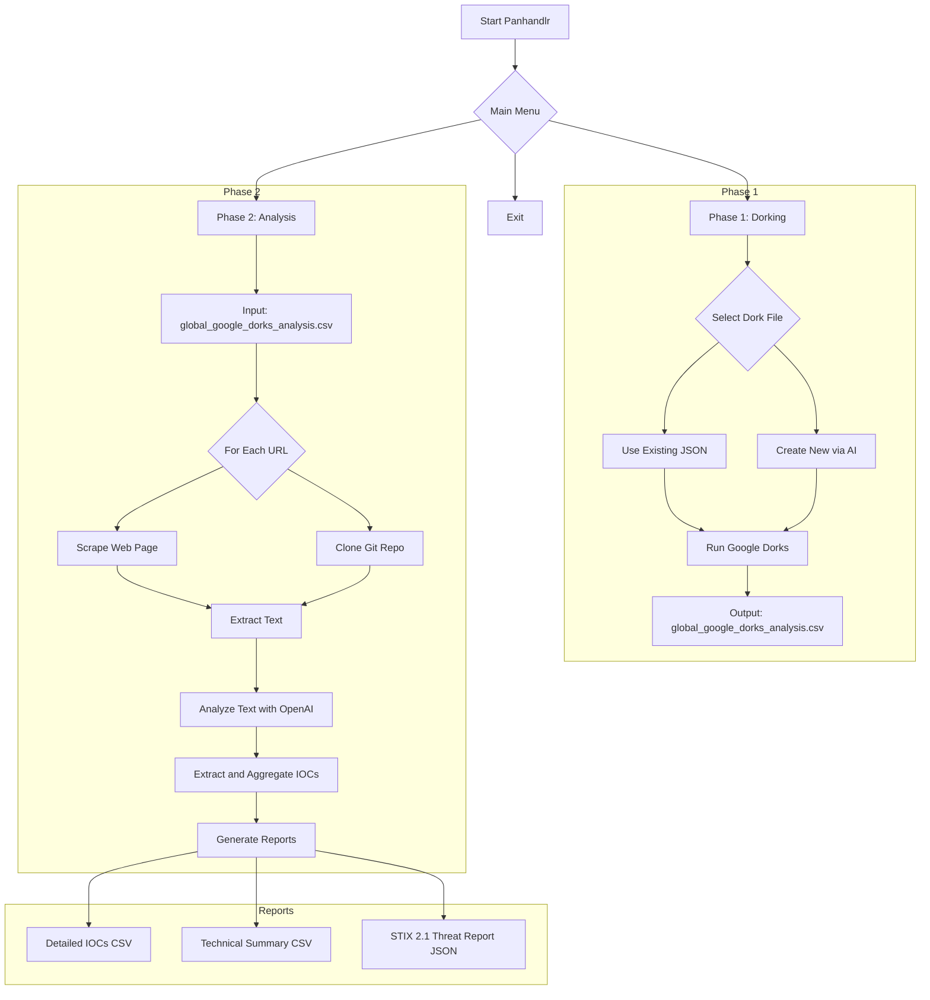

<p align="center">
  
</p>


Panhandlr is an automated OSINT and threat intelligence gathering tool. It streamlines the process of turning Google Dorks into actionable Indicators of Compromise (IOCs) and structured threat reports. By leveraging the power of AI and web automation, Panhandlr moves from initial discovery to final analysis in a few simple steps.

The tool operates in two main phases:
1.  **Dorking**: Uses Google Dorks from a JSON file (or generates new ones with AI) to find potentially malicious or interesting URLs.
2.  **Analysis**: Scrapes the content from the discovered URLs, uses an AI model to extract IOCs, and generates detailed technical reports in CSV and STIX 2.1 formats.

## Workflow



## Features

-   **Interactive Menu**: A user-friendly, terminal-based interface for easy navigation.
-   **AI-Powered Dork Creation**: Automatically generate comprehensive dork files on any topic using OpenAI's `gpt-4o`.
-   **Extensible Dorking Engine**: Use and create your own JSON-based dork files for repeatable research.
-   **Automated Google Searching**: Executes dorks using the Google Custom Search API to find relevant URLs.
-   **Intelligent Content Scraping**: Fetches text from both static sites (`newspaper3k`) and dynamic, JavaScript-heavy pages (`selenium`).
-   **Git Repository Analysis**: Clones public Git repositories to extract IOCs directly from source code.
-   **AI-Driven IOC Extraction**: Leverages `gpt-4o` to analyze scraped text and extract a wide range of artifacts:
    -   IP Addresses, Domains, and URLs
    -   File Hashes (MD5, SHA1, SHA256)
    -   CVEs and MITRE ATT&CK TTPs
    -   Malware Families and Threat Actor names
    -   Actionable hunting narratives.
-   **Multi-Format Reporting**: Generates three distinct reports:
    1.  A detailed, per-URL breakdown of all IOCs found.
    2.  A high-level, AI-generated technical summary of the threat landscape.
    3.  A machine-readable STIX 2.1 report for easy integration with security tools.
-   **Automatic Defanging**: All relevant indicators in reports are automatically defanged (e.g., `http://` -> `hxxp://`, `example.com` -> `example[.]com`).

## Setup & Installation

### Prerequisites
- Python 3.7+
- Git

### 1. Clone the Repository

```bash
git clone https://github.com/your-username/panhandlr.git
cd panhandlr
```

### 2. Install Dependencies

Install all the required Python libraries using the `requirements.txt` file.

```bash
pip install -r requirements.txt
```

This will also install `chromedriver-manager`, which automatically handles the Selenium WebDriver.

### 3. Configure Environment Variables

Panhandlr requires API keys for Google Custom Search and OpenAI.

1.  Create a `.env` file in the root directory of the project:
    ```bash
    touch .env
    ```
2.  Add the following keys to the `.env` file:

    ```env
    # Get a key from the Google Cloud Console: https://developers.google.com/custom-search/v1/overview
    GOOGLE_SEARCH_API_KEY="YOUR_GOOGLE_API_KEY"

    # Create a Programmable Search Engine and get its ID: https://programmablesearchengine.google.com/
    GOOGLE_CSE_ID="YOUR_CUSTOM_SEARCH_ENGINE_ID"

    # Get a key from the OpenAI Platform: https://platform.openai.com/api-keys
    OPENAI_API_KEY="sk-YOUR_OPENAI_API_KEY"
    ```

##  Usage

Run the main script from the root directory:

```bash
python panhandlr.py
```
You can also use the provided shell script:
```bash
./start_main.sh
```

### Main Menu

The script will present you with three options:

1.  **Dorking Phase**: Start here to gather URLs.
2.  **Analysis Phase**: Run this after the dorking phase to process the results.
3.  **Exit**: Close the application.

#### Phase 1: Dorking Phase

When you select this option, you can either:
- **Select an existing dorks file**: The script will list all `.json` files in the `analyzers/` directory. The `sharepoint.json` file is included as an example.
- **Create New Dorks File**: This option prompts you for a topic. It then uses GPT-4o to generate a new dork file and saves it in the `analyzers/` directory for immediate or future use.

After selecting your dorks, the script will execute them and save all unique URLs found to `analysis/global_google_dorks_analysis.csv`.

#### Phase 2: Analysis Phase

This phase automatically picks up the `global_google_dorks_analysis.csv` file. It iterates through each URL, scrapes its content, extracts IOCs, and generates the final reports.

The output will be saved in the `analysis/` directory:
-   `detailed_ioc_report_defanged.csv`: A row-by-row breakdown of IOCs found for each source URL.
-   `technical_summary_report_defanged.csv`: A consolidated report with an AI-generated summary and lists of all unique indicators.
-   `stix_threat_report.json`: A structured STIX 2.1 bundle containing all relevant indicators, threat actors, and malware families.

## Project Structure

```
.
├── analyzers/                # Contains JSON dork files
│   └── sharepoint.json
├── analysis/                 # Directory for all output reports
├── modules/                  # Core logic scripts
│   ├── google_dorks_standalone.py  # Handles the dorking phase
│   └── url2ioc.py                  # Handles the analysis and reporting phase
├── panhandlr.py              # Main entry point with the user interface
├── requirements.txt          # Python dependencies
├── banner.txt                # ASCII art banner
└── start_main.sh             # Helper script to run the application
```

### Dork File Structure (`analyzers/*.json`)

The dork files are simple JSON objects. You can create your own for different research topics. The script supports placeholders `{domain}` and `{domain_no_tld}` for domain-specific searches, though the main handler currently runs them globally.

**Example from `sharepoint.json`:**
```json
{
  "google_dorks": [
    {
      "name": "SharePoint CVE-2025-53770 or 53771 Mentions",
      "dork": "(\"CVE-2025-53770\" OR \"CVE-2025-53771\") site:{domain}"
    },
    {
      "name": "SharePoint Webshell Artifacts",
      "dork": "site:{domain} (inurl:spinstall0 OR inurl:ghost) inurl:.aspx"
    }
  ],
  "social_media_dorks": [
    {
      "name": "CVE Mentions on Twitter",
      "dork": "site:twitter.com (\"CVE-2025-53770\" OR \"CVE-2025-53771\") sharepoint"
    }
  ]
}
```
